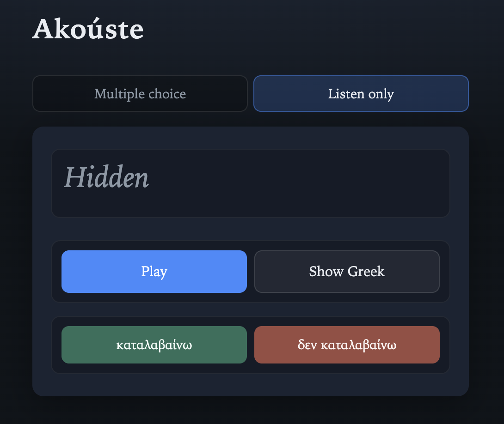
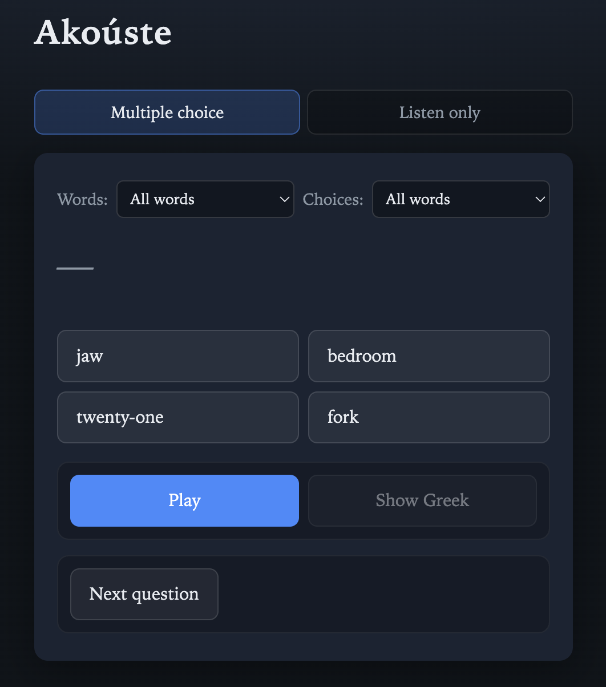

# Akoúste

Live at: [https://pnthomas.github.io/akouste/](https://pnthomas.github.io/akouste/)  

Akoúste is a listening-comprehension practice app for Greek (akoúste means "listen" in Greek). The goal is to make listening practice easy and low-stress, and to allow beginners following a classroom course to align it to their course's vocabulary.

Runs in browser via web so it should work on any device. Tested on OSX + Chrome and Pixel 9 + Chrome. It uses TTS so you might have to add Greek as a supported TTS language on your mobile device, see **Mobile Setup**, below.

  
  

## Purpose

- **Focus on listening, not speaking:** The primary skill is listening comprehension; speaking is secondary and comes later via voice answers.
- **Low-stress, confidence-building practice:** Short, simple, highly constrained questions with clear, unambiguous answers.
- **Aligned with classroom vocabulary:** Questions only use words from a configurable vocabulary list (e.g. a class word list).

## Modes

1. **Single word:** Listen only
2. **Multiple choice:** Listen and select the English gloss (recognition)
3. **Speak English:** Hear the Greek word, answer with the English gloss by voice (`en-US` speech recognition); optional English voice commands (again, skip, etc.).
4. **Questions:** The app **speaks a question in Greek** (using TTS or pre-recorded audio), learner **answers** (recall). Via **text** for the first iteration, then later via **voice**.

## Question Mode (The goal of the project)

### Question Design

- **Closed-ended and simple:** Questions are crafted so answers are short and easy to grade:
  - Yes/no answers.
  - Simple nouns (e.g. room, object, relation).
  - Simple numbers, colors, names, actions.
- **Examples (in English for illustration):**
  - "In what room is the oven?" → "The kitchen."
  - "Is your uncle a woman?" → "No."
  - "How many legs do you have?" → "Two."
- **Goal:** Not deep reasoning, just clear signals that the learner heard and understood correctly.

### Corpus strategy for Questions

To keep runtime simple and cheap, Akoúste uses a **pre-generated, finite corpus** of Q&A pairs:

1. **Generate English Q&A with an LLM**
  - Use a large language model to create hundreds of simple, closed-ended Q&A pairs in **English**, constrained by:
    - Target difficulty.
    - A specific **vocabulary list** (words the student has learned in class).
2. **Human review and pruning**
  - Manually remove or edit:
    - Awkward, confusing, or ambiguous questions.
    - Items that don't fit the desired style or difficulty.
3. **Translate to Greek with constraints**
  - Use the LLM again to translate vetted English Q&A into **Greek**, with instructions to:
    - Respect the same vocabulary list.
    - Keep answers short and closed-ended.
4. **Export for the app**
  - Store the final Greek Q&A in a **JSON (or similar) file** that the app loads at runtime.
  - Optionally pre-generate **audio files** (e.g. `.mp3`) for each question.

This process can be repeated a few times to build a large, offline corpus.  
Later, a **live-generation mode** can be added as an optional feature for extra variety.

## Platform and tech (high level)

- Static single-page app hosted on GitHub Pages, mostly HTML
- Pre-generated Q&A JSON files (and optional audio files).
- No backend required for the early phases.
- **Data and privacy:**
  - Stats and progress can live in **browser storage** (e.g. `localStorage`), so no server or account system is required initially.

## Audience and scope

- **Primary audience:** You (the creator) and other beginner/intermediate learners of Greek.
- **Secondary audience:** Potentially other learners or teachers who want:
  - Custom word lists aligned with their class.
  - A low-friction, focused listening tool.
- **Out of scope for early versions:**
  - Native mobile apps and app store distribution.
  - Multi-user account systems and cloud-sync of stats.

## Roadmap (capabilities)

Capabilities are ordered **1 → 9** to match the phased plan in `[.cursor/plans/roadmap.md](.cursor/plans/roadmap.md)`. Early work centers on **classroom vocabulary** and **English-backed answers**; **short Greek questions with Greek answers** comes later (phases 7–8). Details and milestones live in that file.

1. ~~**Vocabulary intake**~~
  - Greek/English pairs (plus topic and grammatical category) in a stable runtime format.  
  - Near term: Google Sheet → export / script → JSON checked in or generated at build.
2. ~~**Random Greek word, listening-first**~~
  - Pick a word from the list, play it in Greek (TTS or bundled audio).  
  - Default: **no on-screen Greek** while listening; optional reveal after play.
3. ~~**Multiple choice (English gloss)**~~
  - Hear Greek, choose the correct English gloss: **four** options = one correct + **three distractors**.  
  - UI: **“Select words from [X] and choices from [Y]”** — two independent dropdowns (same options: **All words**, then each **subcategory** / topic). **X** limits which words can be prompted; **Y** limits where distractor glosses are drawn from. Default **All** / **All** = fully random.  
  - Immediate feedback (**ding** / **bong**); outcomes feed phase-4 stats when implemented.
4. **Minimal stats**
  - Persist enough for **spaced repetition** and “what to drill next.”  
  - **Browser-only** storage (e.g. `localStorage` / IndexedDB); no accounts.  
  - Refined alongside phase 3 as modes grow.
5. **Typed English answer**
  - Type the English gloss; normalize (trim, case), compare to the expected string, same feedback pattern as MCQ.
6. **Spoken English answer (STT)**
  - Speak the English gloss; speech-to-text (`en-US`), then rule match to the expected gloss; Web Audio feedback; **English** voice commands for hands-free control (again / I don’t know / stop). Greek spoken commands may be added later as polish.
7. **Greek questions + answers in Greek** *(deferred)*
  - Move from isolated words and English answers to **short Greek questions** heard in full, with **short Greek answers** (typed and/or spoken). Requires a curated Greek Q&A corpus.
8. **Expand Greek question practice** *(deferred)*
  - More items, difficulty, topics; optional richer shapes or optional live generation—still **question in Greek → answer in Greek**.
9. **Richer stats and more vocabulary intake options** *(later)*
  - **Stats:** Beyond minimal SRS—e.g. latency, strengths/weaknesses by word or topic, optional weighting toward weak areas, lifetime vs session views (still client-side unless the product changes).  
  - **Vocabulary:** Paste/upload CSV, camera + OCR, or audio-based capture with review—beyond the phase-1 Sheet path.

**Milestone:** Phases **3, 5, and 6** are the **English-language word loop** (MCQ → typed → voice). **Phase 4** adds minimal stats alongside. That loop should be solid before phase 7.

## Isn't this just Duolingo with extra steps?

Yes and no. Mostly no. It shares with Duolingo the core idea of low-friction computer-mediated language learning. However, unlike Duolingo, which is intended to provide a gamified experience for casual users where the goal is engagement rather than actual learning, this app is intended to support dedicated language learners who want to drill specific vocabulary and specifically listening, which is the hardest skill to develop in a classroom setting.

---

## Mobile Setup

**Greek TTS** depends on your OS/browser voices—if audio is wrong or silent, check system speech/voice settings and try another browser.  

**Install Greek voice data (Pixel / Android):**

- Open **Settings** → **System** → **Languages** (on some devices **Languages & input**).
- Under **Preferred languages**, add **Ελληνικά** (Greek).
- Open **Text-to-speech** (often from the same **Languages** screen, or under **Languages & input**).
  - Choose **Language** → Greek.
  - Tap the **cog** next to **Preferred engine** (often Google Speech Services) → **Install voice data**.
- Optionally, in **App languages**, set **Chrome** (or your browser) to **Ελληνικά** if you want Greek UI where supported.
- **Chrome:**
  - Ensure Chrome isn't in "Data Saver" mode, which can sometimes block the fetching of remote TTS assets.

---

## Local Testing

akouste % npm install 
akouste % npm run dev                             
